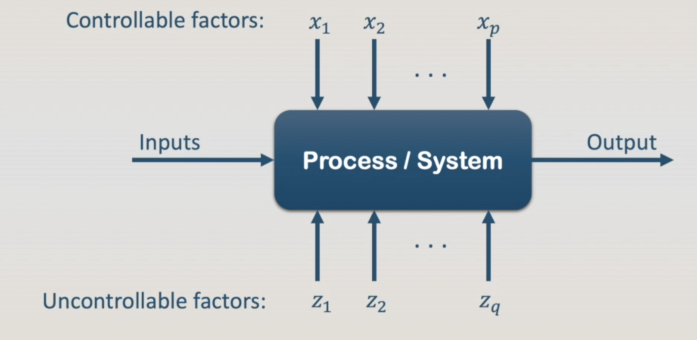

# Section 1: Introduction do the Design of Experiments (DoE)

### 1. Introduction

<figure><figcaption></figcaption></figure>

<figure><figcaption></figcaption></figure>

### 2. Basic Principles of the Design of Experiments

1. Randomization

Randomization means that both the allocation of **experimental material** and the **order** in which the individual runs will be performed are **randomly determined**.

_Randomization is the cornerstone underlying the use of statistical methods in the experimental design. It assures that errors are independently distributed among the runs._

2. Replication

Replication means an independent repeat run of each factor combination.

_Replications reflect the sources of variability of the system._

3. Blocking

Blocking is used to eliminate the variability transmitted by nuisance factors.

_A block is a set of relatively homogeneous experimental conditions._

### 3. Basic Statistical Concepts

An engineer aims to evaluate if the addition of a polymer emulsion in a cement mortar affects the tension bond strength of the product.

The experimenter has collected:

* 10 observations of the modified mortar and
* 10 observations of the unmodified formulation

<figure><figcaption></figcaption></figure>

The differences among the individual runs in the same treatment is called: noise or experimental error or error.

Dot Diagram:

<figure><figcaption></figcaption></figure>

### 4. Sampling and Sample Properties

<figure><figcaption></figcaption></figure>

<figure><figcaption></figcaption></figure>

<figure><figcaption></figcaption></figure>

<figure><figcaption></figcaption></figure>

### 5. Hypothesis Testing: t-Test and F-Test

<figure><figcaption></figcaption></figure>

<figure><figcaption></figcaption></figure>

<figure><figcaption></figcaption></figure>

<figure><figcaption></figcaption></figure>

<figure><figcaption></figcaption></figure>

